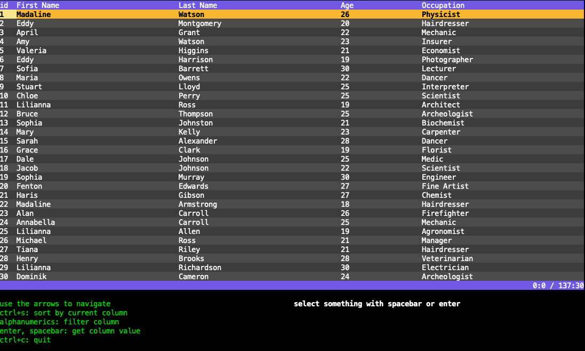

# Examples

## [`flex-box-horizontal`](./flex-box-horizontal/)
Flexbox example with three columns and two, one, and three cells in each column, respectively.

## [`flex-box-simple`](./flex-box-simple/)
Flexbox example using four rows with three, seven, five, and five columns, respectively. The cells have varying heights and widths, so their distribution is non-uniform.

## [`flex-box-with-table`](./flex-box-with-table/)
Flexbox example with three rows. The middle row contains three cells with the middle cell containing a table.

## [`table-simple-string`](./table-simple-string/)
Reads in [`sample.csv`](./sample.csv) and creates a table with the data. The value of each cell is a string.

## [`table-multi-type`](./table-multi-type/)
Reads in [`sample.csv`](./sample.csv) and creates a table with each column set to be a `string` or `int` as appropriate. Looks the same as `table-simple-string`, so the screenshots are identical.

